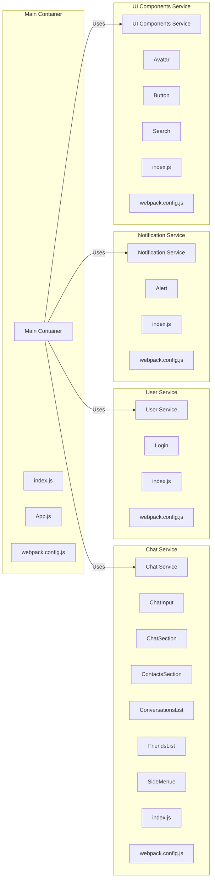

# Getting Started with Messenger App

This project was bootstrapped with [Create React App](https://github.com/facebook/create-react-app).

## How to Clone and Install the Project

To clone and install the project, follow these steps:

1. **Clone the repository**:

   ```sh
   git clone https://github.com/SoroushGhodrat/messenger-app.git
   ```

2. **Go to the project directory**:

   ```sh
   cd messenger-app
   ```

3. **Install dependencies**:
   ```sh
   npm install
   ```

## Available Scripts

In the project directory, you can run:

### `npm start`

Runs the app in the development mode.\
Open [http://localhost:3000](http://localhost:3000) to view it in the browser.

The page will reload if you make edits.\
You will also see any lint errors in the console.

### `npm run build`

Builds the app for production to the `build` folder.\
It correctly bundles React in production mode and optimizes the build for the best performance.

The build is minified and the filenames include the hashes.\
Your app is ready to be deployed!

See the section about [deployment](https://facebook.github.io/create-react-app/docs/deployment) for more information.

## Libraries and Technologies Used

This project uses the following libraries and technologies:

- **React**: A JavaScript library for building user interfaces.
- **TypeScript**: A typed superset of JavaScript that compiles to plain JavaScript.
- **React Router**: A library for routing in React applications.
- **CSS Modules**: A CSS file in which all class and animation names are scoped locally by default.
- **Styled Components**: A library for writing CSS in JavaScript.
- **UUID**: A library for generating unique identifiers.
- **Local Storage**: Used for storing user data persistently in the browser.
- **Context API**: Used for managing global state in the application.
- **React Testing Library**: A library for testing React components.

## Project Structure

The project structure is organized as follows:

- `src/components`: Contains all the React components used in the application.
  - `Chat`: Components related to the chat functionality.
  - `UI`: Reusable UI components like buttons and alerts.
  - `common`: Common components like the header.
- `src/pages`: Contains the main pages of the application.
  - `Chat`: The chat page.
  - `Login`: The login page.
  - `404`: Error page.
- `src/store`: Contains the context and state management logic.
- `src/types`: Contains TypeScript type definitions.
- `src/utils`: Utility functions used across the application.
- `src/mock`: Mock data used for development and testing.

```
───src
    ├───components
    │   ├───Chat
    │   │   ├───ChatInput
    │   │   ├───ChatSection
    │   │   ├───ContactsSection
    │   │   ├───ConversationsList
    │   │   ├───FriendsList
    │   │   └───SideMenue
    │   └───UI
    │       ├───Alert
    │       ├───Avatar
    │       ├───Button
    │       └───Search
    ├───mock
    ├───pages
    │   ├───404
    │   ├───Chat
    │   └───Login
    ├───store
    ├───types
    └───utility
```


### Some markdown

## Explanation

### Main Container:
- **Files**: `index.js`, `App.js`, `webpack.config.js`

### Chat Service:
- **Components**: `ChatInput`, `ChatSection`, `ContactsSection`, `ConversationsList`, `FriendsList`, `SideMenue`
- **Files**: `index.js`, `webpack.config.js`

### User Service:
- **Components**: `Login`
- **Files**: `index.js`, `webpack.config.js`

### Notification Service:
- **Components**: `Alert`
- **Files**: `index.js`, `webpack.config.js`

### UI Components Service:
- **Components**: `Avatar`, `Button`, `Search`
- **Files**: `index.js`, `webpack.config.js`

## License

This project is licensed under the MIT License.
